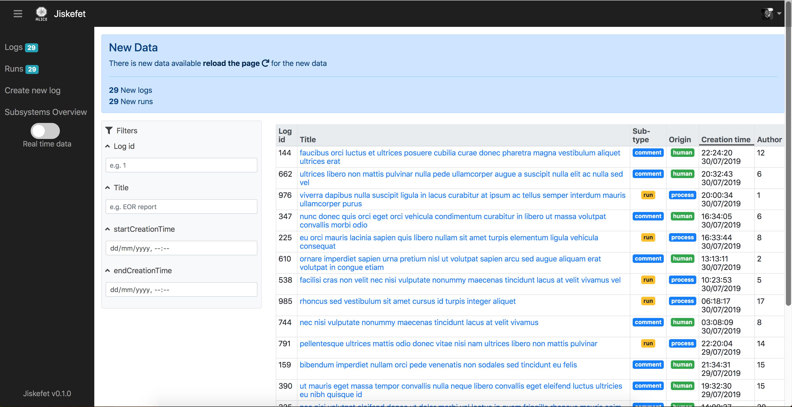
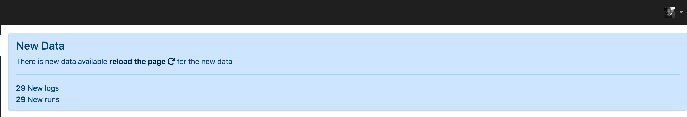
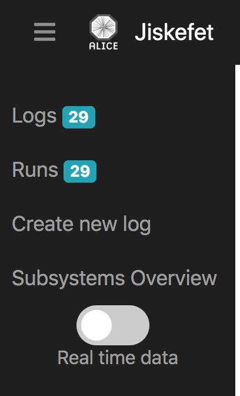

# Project 3 @cmda-minor-web · 2018-2019

## CERN Jiskefet
Jiskefet is a tool to display data from CERN's ALICE project.

We've been given the task to add a feature to the [Jiskefet](http://cmd.jiskefet.io) system that was build by students from HvA ICT



## Table of contents
- [Demo](#Demo)
- [Concept](#Concept - Real-time notifications)
  - [Notifications](#Notifications)
  - [Badges](#Badges)
- [Installation](#Installation)

## Demo
[Demo](https://jiskefet-alice.herokuapp.com/)|[Repo](https://github.com/dorusth/project-3-1819)

## Concept - Real-time notifications
For the Jiskefet system i've made a feature to get info about the real-time data from ALICE using WebSockets.

During runs there is a lot of data added to the system which would clutter the screen if added immediately, for this i've added notifications to show the users the amount of new runs and logs that were added since opening the page and the option to show the new data.

### Notifications

On the server data is recieved and the information about the amount of updates is sent to the client. on the client side a check is made to see of there are more logs/runs than are shown to the client. If there is new data a notification is shown to the user with the amount of new logs/runs.

### Badges

When the user receives new data and the notification is shown there ar also badges shown in the according menu item on the left side of the page as an indication to the user.

## Installation
This project works with: node, express, Handlebars, socket.io and compression.
Clone the repo with:
```bash
$ git clone https://github.com/dorusth/project-3-1819.git
```
to use the app use
```bash
$ cd project-3-1819/week-2-3
$ npm install
$ npm start / $ npm run dev
```
and open "http://localhost:3030/"


[MIT](LICENCE) © [Dorus ten Haaf](https://dorustenhaaf.com)
